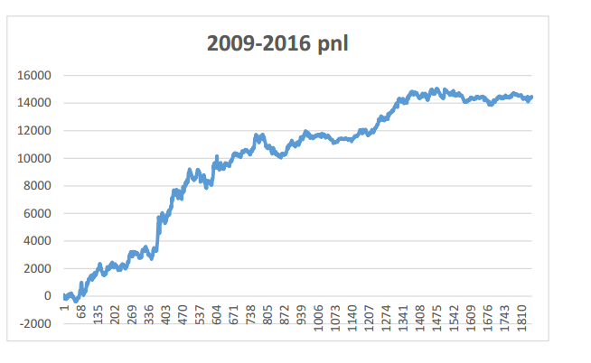
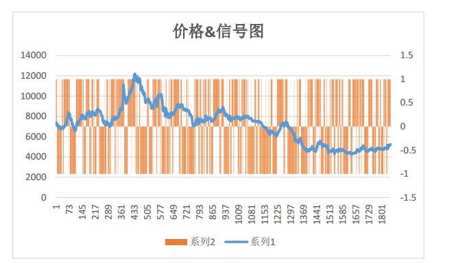
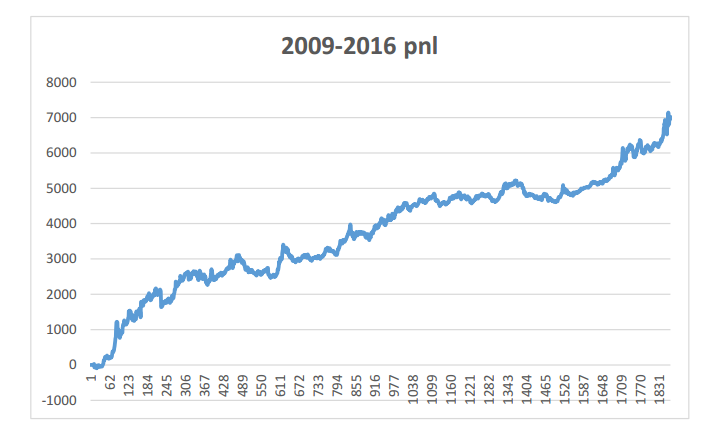
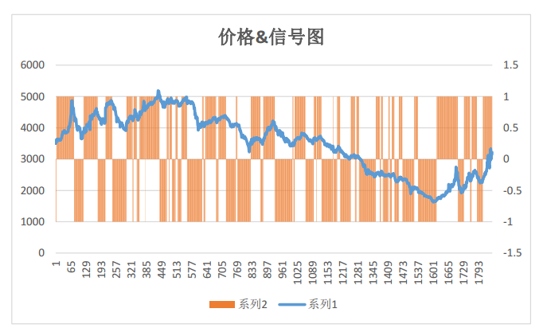

# Low-lag Trendline &  timing strategy on futures
## Idea
The method of Low-lag Trendline regard price as signal. So many signal-processing method are applied to analyse the futures, such as [Fourier transform](https://en.wikipedia.org/wiki/Fourier_transform)(FT). If you need more details,please refer to this report [低延迟趋势线与交易性择时](./低延迟趋势线(LLT)与交易性择时研究.pdf) 
## Model
I use a VBA program to implement this strategy([Check here](./model)). I use low-frequency(day-level) to test this strategy.Totally, I test  nine kinds of commodity futures, one index and one stock.Some results can be shown as follows.
## Result
* **PTA**

* **RB**

