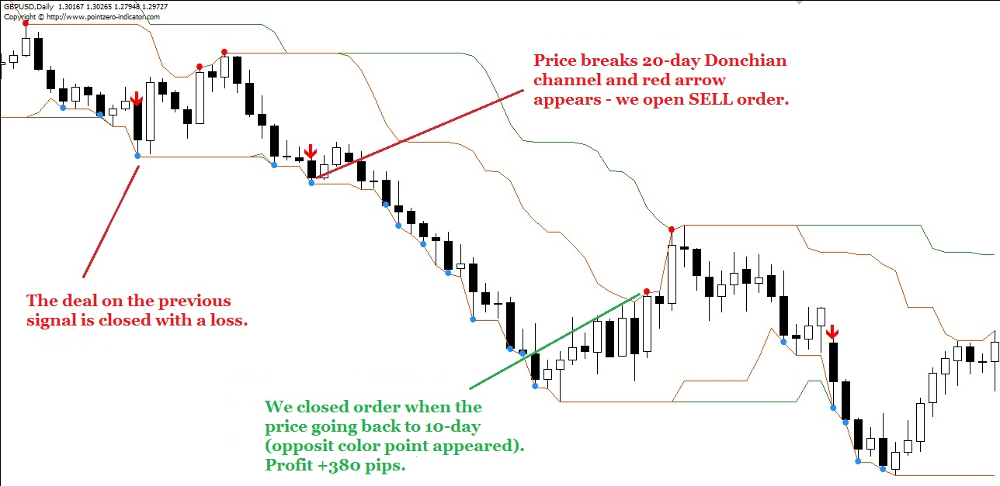
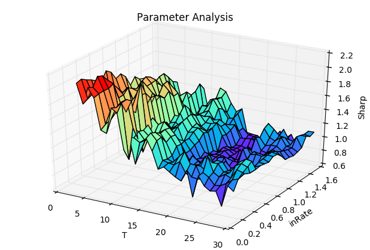
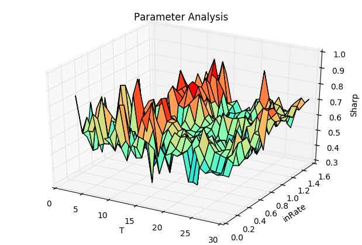
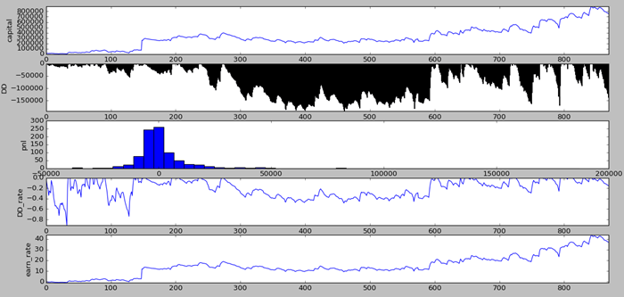
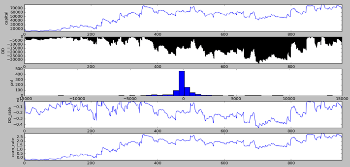
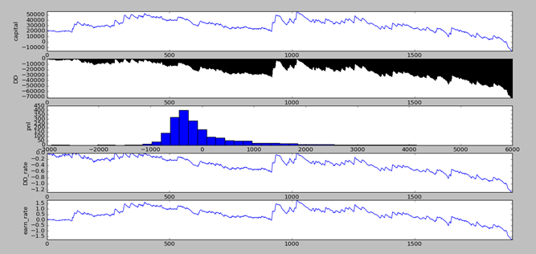

# Turtle Trading Strategy
## Idea
Turtle trading is a well known trend following strategy that was originally taught by Richard Dennis. The basic strategy is to buy futures on a 20-day high (breakout) and sell on a 20-day low. I've modeled the main part of the strategy and used it to trade screw steel (螺纹钢) commotity future(RB), in this case just main contract.

I used rules from [here](http://bigpicture.typepad.com/comments/files/turtlerules.pdf). From what I have seen, the rules of turtle trading slightly vary from source to source. If you want to adjust the rules you can check my code and I've also added an optimizaiton of parameters in the code
This is a pretty fundamental strategy and it seems to work well. There are a few different parameters to play with, so clone this and see if you can get some good results or even add to the code.

If you want to test other futures, you can get ideas from this code and just replace the [data file](./data.csv) which store the underlying's price. 
## Model
 
### Market
The Turtles trade liquid futures.If a trader chose not to trade in a particular market, then he will not trade that market at all.
### Position Size
* **Unit =（ 1% of Account) / (N * Dollars per point)**
* **N = ATR * Dollars per point**
* **ATR=mean(TR,20)**, average of the True Range
* **TR = max(H−L,H−PDC，PDC−L)**, True Range
	* **H** - Current High，**L**-Current Low，**PDC**-Previous Day's Close
### Entries
* **Breakout**
	* Turtles entered positions when the price exceeded by a single tick the
high or low of the preceding 20 days. If the price exceeded the 20-day high, then the Turtles would buy one Unit to initiate a long position in the corresponding
commodity. If the price dropped one tick below the low of the last 20-days, the Turtles would sell one Unit to initiate a short position.

* **Adding Units**
	* Turtles entered single Unit long positions at the breakouts and added to those positions at ½ N intervals following their initial entry.
### Stops
The Turtles placed their stops based on position risk. No trade could incur more than **2%** risk. In order to keep total position risk at a minimum, if additional units were added, the stops for earlier units were raised by ½ N. This generally meant that all the stops for the entire position would be placed at **2N** from the most recently added unit.
### Exits
**10 day** low for long positions and a 10 day high for short
positions. All the Units in the position would be exited if the price went against the position for a 10 day breakout.
## Parameter Analysis
There are two very important parameters in Turtle strtegy, namely,Channel Breakout Days (denoted as **T** ) and size of following their previous entry (denote as **inRate**). I use Sharp Ratio to optimize the two parameters. Also, There are two situations, considering fees or not.

* **Parameter Analysis without fees**

 

* **Parameter Analysis with fees**

 

## Result - RB future

* 10 bar close data from 2016-1-1 to 2017-3-8 
* T=10, pricipal=20,000
* no limits on units

----------

* 10 bar close data from 2016-1-1 to 2017-3-8 
* T=10, pricipal=20,000
* fix units as 1

----------

* 1 bar close data from 2016-1-1 to 2017-3-8 
* T=60, pricipal=20,000
* fix units as 1

