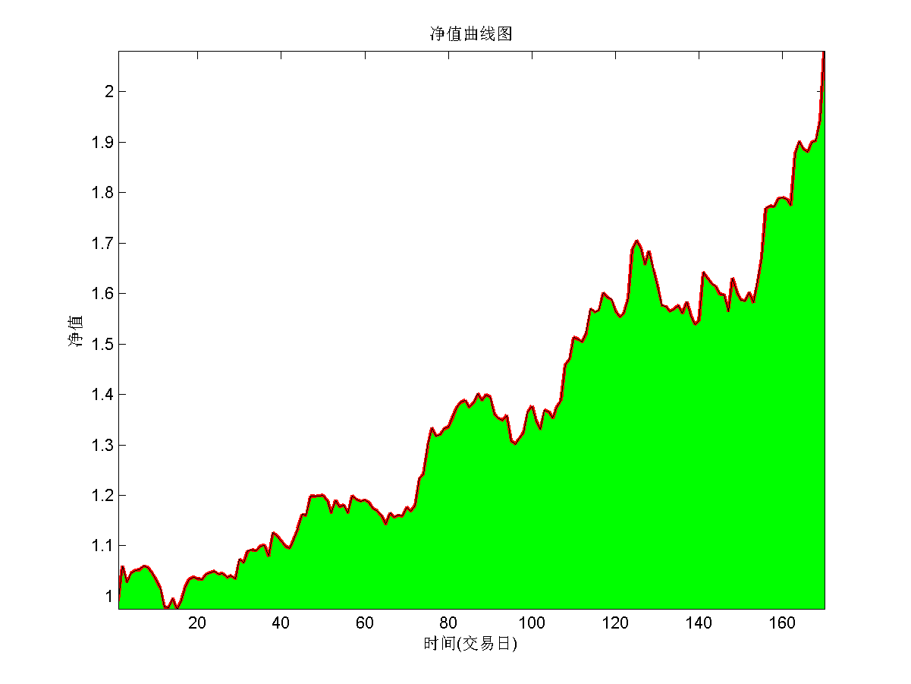
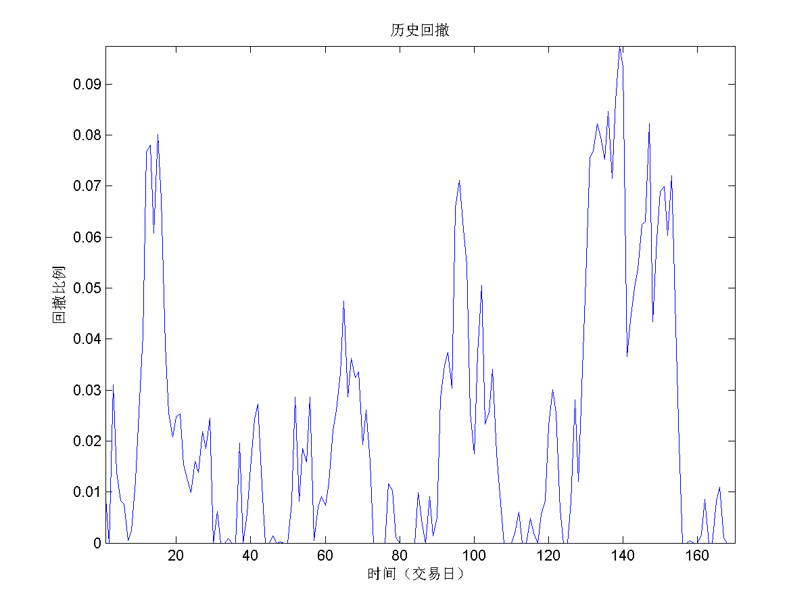
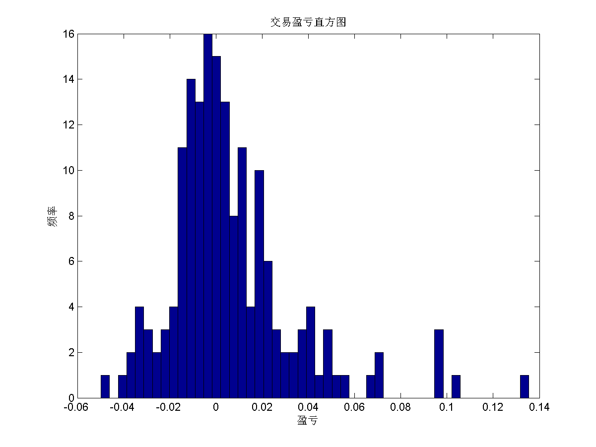
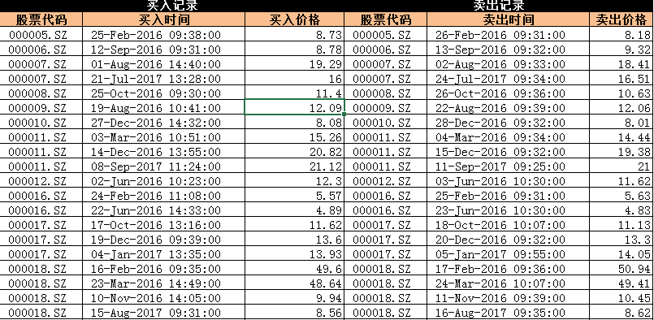

# Price Limit Strategy on stocks of A share
## Idea
The range of stock's price limits is 10% in China. It is rather lower compared to other contries. The price ca not nbe valued because of the constraints. There are some opportunities to do a trading.
## Model
I use a `MATLAB` program to implement this strategy([check code](./model)). High-frequency (bar-level) data is required to test this strategy.

* **Entry**
	*  If a stock reaches the price-up limit three times continuously, We will mark it. And once it reach the price-up limit, we will buy it.
* **Exit**
	* All holding stocks will be sold in the next trading day. They should be sold as least 10:00 AM.
## Result
* **Net Value of the Porfolio**

* **Drawdown Rate**

* **Histogram of Returns**

## Transaction

More details about the transaction, you can check [here](./Transaction.xlsx). 
